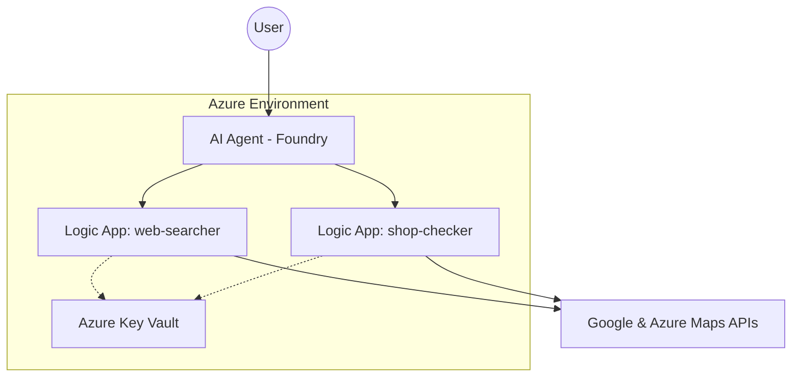

# Azure AI Holiday Planner: An Agentic Approach to Travel

## The Problem: The "Shopping Density" Dilemma

Every year, I plan a family holiday. Standard travel sites make it easy to filter by "Beach" or "Price," but my Mum and Sister consistently require "Shopping and Centrality." The challenge is that "Central" is often a marketing term that leads to AI hallucinations and unreliable recommendations. This project turns a recurring family need into a business case for a technical solution: move from *searching* to *verifying* by using AI agents and geospatial data.

## The Architecture: A Serverless Agentic Workflow

The system is designed as a serverless agentic workflow that pairs autonomous reasoning with specialized execution:

- **Orchestrator**: **Azure AI Foundry Agent** (GPT-4) coordinates the end-to-end workflow.
- **Tooling Layer**: **Azure Logic Apps (Consumption)** act as specialized "Hands" for the agent, each handling a focused task.
- **Data Sources**: **Google Custom Search API** (real-time pricing signals) and **Azure Maps API** (geospatial verification).
- **Hosting**: **Azure Static Web Apps** serves the front-end experience.

## Security & Infrastructure

Security is built into the architecture from the start:

- **Managed Identities**: No hardcoded API keys. All services use System-Assigned Managed Identities to access secrets.
- **Azure Key Vault**: Centralized secret management for Google and **Azure Maps** keys.
- **IP Whitelisting**: Google API keys are restricted to the outbound IP addresses of the **Azure Logic Apps** region to prevent unauthorized use.

## Environment & Setup

Set the following secrets in your own **Azure Key Vault**:

- `GOOGLE_API_KEY`
- `GOOGLE_SEARCH_ENGINE_ID`
- `AZURE_MAPS_KEY`

## Visual Documentation

*Architecture diagram placeholder.*

